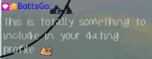

**THIS IS THE ORIGINAL VERSION, NOW DEPRECATED.** Instead use `https://gooplet0075.github.io/tp-chat//v2.0/?twitchChannel=[YourChannelHere]`, and refer to the current [README.MD](https://github.com/gooplet0075/tp-chat/blob/main/README.md). I'm leaving this version up for the time being, so your links don't break if you're using it as is. 

# Toki Pona Twitch chat overlay
toki a! ilo ni li pana e sitelen pona lon lipu Tuwi! mi awen pali e ilo. mi kama sona e HTML e CSS e Javascript. 

Display toki pona words in your Twitch chat formatted in sitelen pona! This project is by no means anywhere close to done. I recently started learning HTML, CSS and JavaScript, and I'm using this project to learn the basics of all those things! 

## Features
### Formatting messages
If a message is in toki pona, and all proper names are capitalized and conform to toki pona phonetics, it will automatically be displayed with [nasin-nanpa](https://github.com/ETBCOR/nasin-nanpa). Proper names are displayed with comic sans. Say what you will but I couldn't find a font that seemed a better fit! Features like cartouches supported by nasin-nanpa can be used as well. Commands starting with '!' currently will not be formatted with nasin-nanpa. 

If a specified Twitch user sends a message in your chat, it will display in [Kabina Font](https://www.fontspace.com/kabina-font-f22386) which looks like a child's handwriting, because I thought this was funny. To specify a user, add  `&troll=[UserName]` to the end of the URL detailed in the section ["Adding the overlay to your stream"](https://github.com/gooplet0075/tp-chat/tree/main?tab=readme-ov-file#adding-the-overlay-to-your-stream)
### Badges
Currently, the most common global badges are supported - broadcaster, moderator, and VIP. I hope to add account connections, which will allow for custom channel badges, as well as full access to all global badges. 
### Emotes
All official Twitch emotes and custom channel emotes are supported. FrankerFaceZ and BetterTTV emotes? Mayyyybeee after all the other items on my to-do list are checked off.
### Moderation
I'm just kinda assuming that messages caught by automod won't show up in this chat overlay. I haven't gotten to test that yet. Messages deleted by mods will disappear from the overlay, though.

### To-Do List
- Include full list of global Twitch badges
- Implement "implicit grant flow" OAuth authorization to connect a Twitch account, in order to gain access to custom badges?
- Add support for "v" formatting of "ni", as well as other nasin-nanpa features
- Add customization options for fonts and background color
- BTTV & FFZ emotes
## Adding the overlay to your stream
In OBS, click the "+" button on the Sources panel and select "browser" to add a browser source. In the pop-up window, paste this url:
`https://gooplet0075.github.io/tp-chat/?channel=[YourChannelHere]`, replacing [YourChannelHere] with your channel name, and removing the brackets. Set the width and heigh to whatever you want; I've found that 337x600 is a good size. Leave the rest of the settings as they are. You're all set! Messages sent to your chat will immediately start showing up in the chat box, even if you aren't live.

## Credit where credit's due
I want to credit the lovely jan Jesika with helping me get started on this project, and for helping me problem-solve throughout the whole process! 
Thanks also to the many Discordians who pointed me in the right direction when I got stuck. 
is-toki-pona.js was generously contributed by [m4ym4y](https://github.com/m4ym4y) since I was clueless about regex.
This project uses the [lipu-linku](https://github.com/lipu-linku/sona) dataset.
The fonts used are [nasin-nanpa](https://github.com/ETBCOR/nasin-nanpa) and [glametrix](https://www.fontspace.com/glametrix-font-f16913).
This project uses [ComfyJS](https://github.com/instafluff/ComfyJS) to integrate with the Twitch API. 
### Bonus
Here are some pictures of my cats Denna and Kvothe as well as Henry the skull

## Licensing
This project is licensed under MIT. IDK what that means really since I'm new to all this but feel free to use it as you see fit, i guess
