**UPDATE:** support for YouTube added!!!

# Toki Pona Twitch chat overlay
toki a! ilo ni li pana e sitelen pona lon lipu Tuwi anu lon lipu Jutu! mi awen pali e ilo. mi kama sona e HTML e CSS e Javascript. 

Display toki pona words in your Twitch chat or YouTube chat formatted in sitelen pona! This project is by no means anywhere close to done. I recently started learning HTML, CSS and JavaScript, and I'm using this project to learn the basics of all those things! 

## Features
### Formatting messages
If a message is in toki pona, and all proper names are capitalized and conform to toki pona phonetics, it will automatically be displayed with [nasin-nanpa](https://github.com/ETBCOR/nasin-nanpa). Proper names are displayed with comic sans. Say what you will but I couldn't find a font that seemed a better fit! Features like cartouches supported by nasin-nanpa can be used as well. Commands starting with '!' currently will not be formatted with nasin-nanpa. 

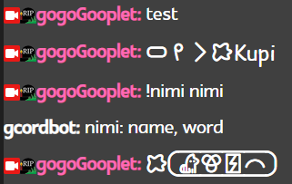
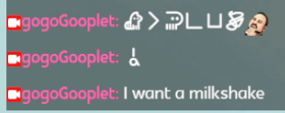
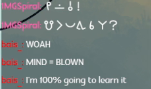
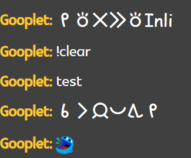

If a specified Twitch user sends a message in your chat, it will display in [Kabina Font](https://www.fontspace.com/kabina-font-f22386) which looks like a child's handwriting, because I thought this was funny. To specify a user, add  `&troll=[UserName]` to the end of the URL detailed in the section ["Adding the overlay to your stream"](https://github.com/gooplet0075/tp-chat/tree/main?tab=readme-ov-file#adding-the-overlay-to-your-stream)
### Badges
Currently, the most common global badges are supported - broadcaster, moderator, and VIP. To avoid needing OAuth, I'm doing a jank workaround of manually adding all custom channel badges to [badges.js](https://github.com/gooplet0075/tp-chat/blob/main/v2.0/badges.js). If you want your badges added, contact me or make a pull request. Eventually I'll add account connections, which will allow automation of all badge thingymajigs. 
### Emotes
All official Twitch emotes and custom channel emotes are supported. FrankerFaceZ and BetterTTV emotes? Mayyyybeee after all the other items on my to-do list are checked off. Global YouTube emotes are available as well.
### Moderation
I'm just kinda assuming that messages caught by automod won't show up in this chat overlay. I haven't gotten to test that yet. Twitch messages deleted by mods will disappear from the overlay, though. On YouTube, this will not happen until a user calls the `!clear` command in chat. 

### To-Do List
- Include full list of global Twitch badges
- YouTube channel emotes
- OAuth 2.0 implicit grant flow for both YouTube and Twitch
- Find a better way to handle YouTube deleted messages
- Add support for "v" formatting of "ni", as well as other nasin-nanpa features
- Add customization options for fonts and background color
- BTTV & FFZ emotes
## Adding the overlay to your Twitch stream
In OBS, click the "+" button on the Sources panel and select "browser" to add a browser source. In the pop-up window, paste this url:
`https://gooplet0075.github.io/tp-chat/v2.0/?twitchChannel=[YourChannelHere]`, replacing [YourChannelHere] with your channel name, and removing the brackets. Set the width and heigh to whatever you want; I've found that 337x600 is a good size. Leave the rest of the settings as they are. You're all set! Messages sent to your chat will immediately start showing up in the chat box, even if you aren't live.

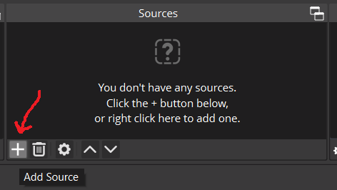
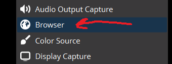

## Add to your YouTube stream
For YouTube, there are some extra steps. First, you'll need a Google API key. Create one by clicking on the "create credentials button" at the [Google Cloud Console Credentials page](https://console.cloud.google.com/apis/credentials) after logging in.

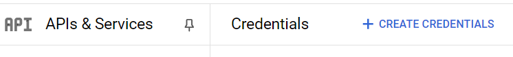

On the "Enabled APIs & Services" age, click the + button and search for "YouTube Data API V3". Select it, and click the "enable" button.
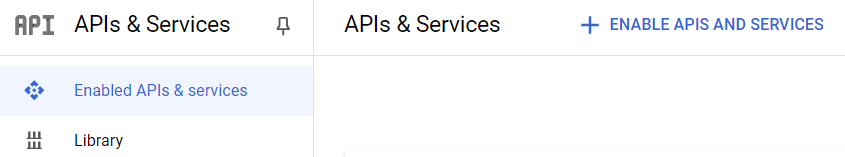

Return to the Credentials page, and click on your API key to edit it. You can name it anything you want, but be sure to restrict it to ONLY YouTube Data API V3.

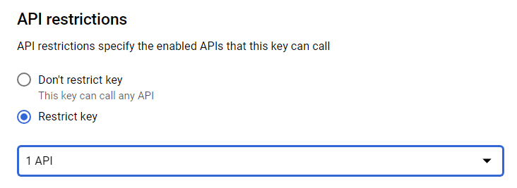

Your API key should be active. Copy it, and follow the Twitch instructions for incorporating it as a browser source in OBS, but with the following link instead: `https://gooplet0075.github.io/tp-chat/v2.0/?gapiKey=[YourAPIKeyHere]&youtubeChannel=[YourChannelHere]`. 

### Limitations
There are some serious issues with this solution. First, chat will not update in real-time; the api calls happen on average every 2 seconds. 

More significantly, however, your api key has a daily quota of 10,000, and over the course of about an hour and a half, you will hit it. This solution will not work for longer streams. 

You can add `&youtubeDelayMultiplier=[NUMBER]` to change the delay between API calls. For example, setting [NUMBER] to 2 will approximately double the length of your stream, but chat will only update every 4 seconds instead of every 2 seconds. 

You can avoid making some of the more costly api calls by replacing the `&youtubeChannel=[YourChannelHere]` query parameter with `&youtubeVideoId=[VideoID]`, where VideoID is your broadcast's ID, which can generally be found at the end of your stream's web address. 

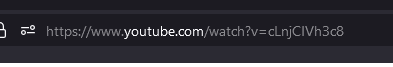

In this example, the video ID is "cLnjClVh3c8". 

Occasionally, you will be able to omit the API key altogether, and it may still work, because it defaults to using [this keyless api thing, idk how it works](https://yt.lemnoslife.com/), but it's very unreliable. 
## Credit where credit's due
I want to credit the lovely jan Jesika with helping me get started on this project, and for helping me problem-solve throughout the whole process! 
Thanks also to the many Discordians who pointed me in the right direction when I got stuck. 
is-toki-pona.js was generously contributed by [m4ym4y](https://github.com/m4ym4y) since I was clueless about regex.
This project uses the [lipu-linku](https://github.com/lipu-linku/sona) dataset.
The fonts used are [nasin-nanpa](https://github.com/ETBCOR/nasin-nanpa) and [glametrix](https://www.fontspace.com/glametrix-font-f16913).
This project uses [ComfyJS](https://github.com/instafluff/ComfyJS) to integrate with the Twitch API. 
### Bonus
Here are some pictures of my cats Denna and Kvothe as well as Henry the skull

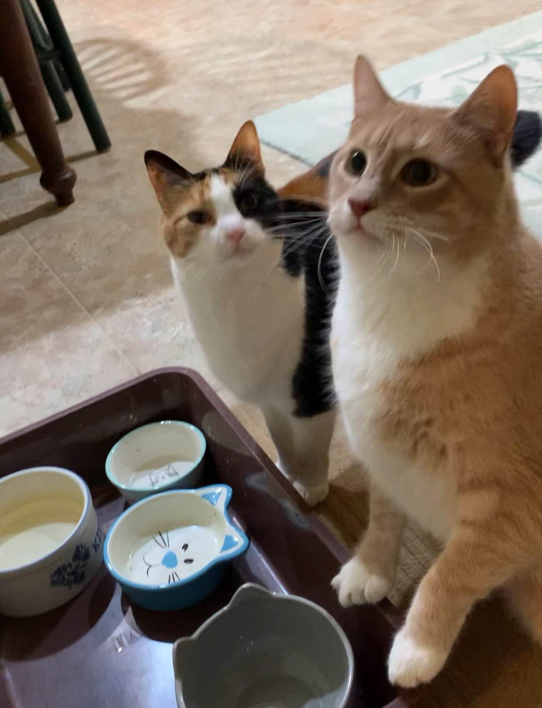

## Licensing
This project is licensed under MIT. IDK what that means really since I'm new to all this but feel free to use it as you see fit, i guess
